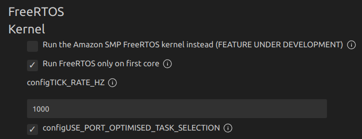
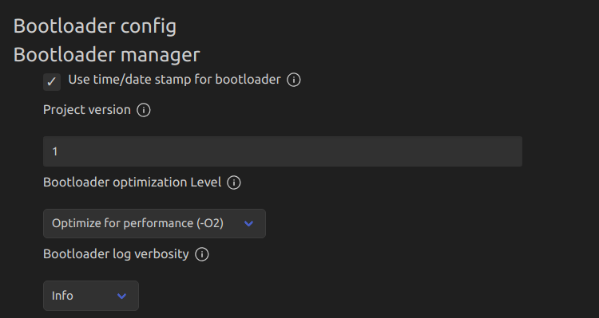

# ESP-IDF component for 10DOF IMU with Kalman filter
9DOF IMU sensor made from sensor fusion of MPU6050 accelerometer and gyroscope, QMC5883L magnetometer and BMP280 pressure sensor.

## Notes
* Adjust Kalman filter with macros: `STD_DEV_V_E`/`STD_DEV_V_H` and `STD_DEV_W_E`/`STD_DEV_W_H` in `kalman_mpu6050.h`.
* Make sure to comment out `// #define BMP280_I2C_INIT   1 // uncomment to initialize I2C driver` in `esp_bmp280.h`.
* This component requires `mpu6050`, `esp_qmc5883l`, `esp_bmp280` and `esp_matrix` components to work.
* Check `imu_get_data()` and `calculate_euler_angle_from_accel` functions for proper MPU6050 and QMC5883L mounting and edit them if needed.

## SDK configuration
* Set `configTICK_RATE_HZ` to `1000`.



* Set `Bootloader optimization Level` to `Optimize for performance (-O2)`.



## Sources
* https://github.com/espressif/esp-bsp/tree/8a042287f67573e757ff25f8bb6372c3fffb5313/components/mpu6050
* https://github.com/JanG175/esp_matrix
* https://github.com/JanG175/esp_qmc5883l
* https://github.com/JanG175/esp_bmp280

## How 2 use?
```C
#include <stdio.h>
#include "freertos/FreeRTOS.h"
#include "freertos/task.h"
#include "kalman_9dof_imu.h"
#include "esp_log.h"

#define I2C_NUM        I2C_NUM_1
#define I2C_SDA_PIN    GPIO_NUM_15
#define I2C_SCL_PIN    GPIO_NUM_18
#define I2C_FREQ       400000

static const char *TAG = "main";


void app_main(void)
{
    imu_i2c_conf_t mpu_conf = {
        .i2c_num = I2C_NUM,
        .sda_pin = I2C_SDA_PIN,
        .scl_pin = I2C_SCL_PIN,
        .i2c_freq = I2C_FREQ
    };
    imu_init(mpu_conf);

    while (1)
    {
        kalman_euler_angle_t euler_angle;
        imu_get_euler_angle(&euler_angle);

        printf(">kalman_acce_roll:");
        printf("%f\n", euler_angle.acce_roll);
        printf(">kalman_acce_pitch:");
        printf("%f\n", euler_angle.acce_pitch);
        printf(">kalman_mag_yaw:");
        printf("%f\n", euler_angle.mag_yaw);
        printf(">kalman_gyro_roll:");
        printf("%f\n", euler_angle.gyro_roll);
        printf(">kalman_gyro_pitch:");
        printf("%f\n", euler_angle.gyro_pitch);
        printf(">kalman_gyro_yaw:");
        printf("%f\n", euler_angle.gyro_yaw);
        printf(">kalman_pres_height:");
        printf("%f\n", kalman_data.pres_height);
        printf(">kalman_height:");
        printf("%f\n", kalman_data.height);

        vTaskDelay(10 / portTICK_PERIOD_MS);
    }
}
```
