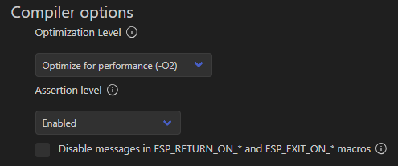

# ESP-IDF component for 10 DOF IMU with Kalman filter
10 DOF IMU sensor made from sensor fusion of MPU6050 accelerometer and gyroscope, HMC5883L magnetometer, TF-LC02 TOF distance sensor and BMP280 pressure sensor.

## Notes
* Start the program while sensors are laying still.
* Adjust Kalman filter with macros: `STD_DEV_V_E`/`STD_DEV_V_H` and `STD_DEV_W_E`/`STD_DEV_W_H` in `kalman_mpu6050.h`.
* Make sure to comment out `#define HMC5883L_I2C_INIT            1 // uncomment to initialize I2C driver` in `esp_hmc5883l.h`.
* Make sure to comment out `#define BMP280_I2C_INIT   1 // uncomment to initialize I2C driver` in `esp_bmp280.h`.
* Make sure to uncomment `#define TFLC02_INIT_UART          1 // uncomment to initialize UART` in `esp_tf-lc02.h`.
* This component requires `esp_mpu6050`, `esp_hmc5883l`, `esp_bmp280`, `esp_tf-lc02` and `espressif/esp-dsp` components to work.
* Check `imu_get_data()` and `calculate_euler_angle_from_accel` functions for proper MPU6050 and HMC5883L mounting and edit them if needed.
* This component will work only with ESP-IDF version greater than v5.2.0.
* Readings from barometer sensor will be used only above 2 m.

## SDK configuration
* Set `configTICK_RATE_HZ` to `1000`.


* Set `Bootloader optimization Level` to `Optimize for performance (-O2)`.


* Set compiler's `Optimization Level` to `Optimize for performance (-O2)`.



Those variables can be also set in `sdkconfig.defaults` file (example for ESP32S3):
```
CONFIG_FREERTOS_HZ=1000
CONFIG_BOOTLOADER_COMPILER_OPTIMIZATION_PERF=y
CONFIG_COMPILER_OPTIMIZATION_PERF=y
CONFIG_ESP_DEFAULT_CPU_FREQ_MHZ_240=y
CONFIG_ESP_DEFAULT_CPU_FREQ_MHZ=240
```

## Sources
* https://github.com/JanG175/esp_mpu6050
* https://github.com/JanG175/esp_hmc5883l
* https://github.com/JanG175/esp_bmp280
* https://github.com/JanG175/esp_tf-lc02
* https://github.com/espressif/esp-dsp

## How 2 use?
```C
#include <stdio.h>
#include "freertos/FreeRTOS.h"
#include "freertos/task.h"
#include "kalman_10dof_imu.h"
#include "esp_log.h"

#define I2C_NUM        I2C_NUM_0
#define I2C_SDA_PIN    GPIO_NUM_3
#define I2C_SCL_PIN    GPIO_NUM_9
#define I2C_FREQ       400000

#define UART_NUM       UART_NUM_1
#define UART_TX_PIN    GPIO_NUM_42
#define UART_RX_PIN    GPIO_NUM_41

static const char* TAG = "main";


void app_main(void)
{
    imu_conf_t imu_conf = {
        .i2c_port = I2C_NUM,
        .sda_pin = I2C_SDA_PIN,
        .scl_pin = I2C_SCL_PIN,
        .i2c_freq = I2C_FREQ,
        .uart_port = UART_NUM,
        .uart_tx_pin = UART_TX_PIN,
        .uart_rx_pin = UART_RX_PIN
    };
    imu_init(imu_conf);

    while (1)
    {
        kalman_data_t kalman_data;
        imu_get_kalman_data(&kalman_data);

        printf(">kalman_acce_roll:");
        printf("%f\n", kalman_data.acce_roll);
        printf(">kalman_acce_pitch:");
        printf("%f\n", kalman_data.acce_pitch);
        printf(">kalman_mag_yaw:");
        printf("%f\n", kalman_data.mag_yaw);
        printf(">kalman_gyro_roll:");
        printf("%f\n", kalman_data.gyro_roll);
        printf(">kalman_gyro_pitch:");
        printf("%f\n", kalman_data.gyro_pitch);
        printf(">kalman_gyro_yaw:");
        printf("%f\n", kalman_data.gyro_yaw);

        printf(">raw_height:");
        printf("%f\n", kalman_data.raw_height);
        printf(">kalman_height:");
        printf("%f\n", kalman_data.height);

        vTaskDelay(DT / portTICK_PERIOD_MS);
    }
}
```
